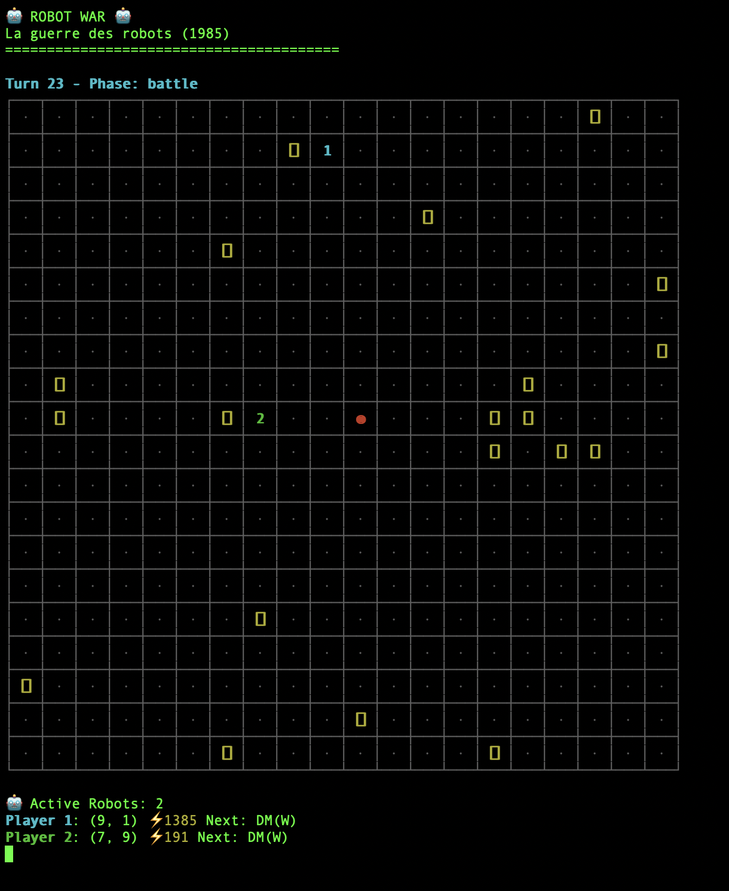

# Robot War 🤖

This is a Python adaptation of the classic turn-based programming strategy game where players program robots to battle in an arena.
Terminal-based display system using Unicode box-drawing characters for grid rendering for a classic retro feel.

## Description

Robot War is a turn-based programming strategy game where players program robots to battle in an arena. Each robot executes a sequence of instructions (movement, attacks, mine laying) while managing limited energy resources.



## Features

- 🤖 Program robots with simple instruction sets
- ⚔️ Turn-based simultaneous execution
- 💣 Mines, obstacles, and tactical positioning
- ⚡ Energy management system
- 🎯 8-directional movement and attacks
- 🌫️ Invisibility and special abilities
- 🏆 1-4 player support with AI opponents

## Installation

### Quick Start
```bash
# Clone the repository
git clone <repository-url>
cd RobotWar

# Run the game
make run
```

### Install as Package
```bash
# Install in development mode
make install

# Run the game
robot-war
```

### Requirements
- Python 3.7+
- Dependencies listed in requirements.txt

## How to Play

1. **Setup**: Configure number of players, robot energy, arena obstacles
2. **Programming**: Write instruction sequences for your robots
3. **Battle**: Watch robots execute programs simultaneously
4. **Victory**: Last robot standing wins!

## Instruction Set

| Code | Action | Energy Cost | Description |
|------|--------|-------------|-------------|
| DM   | Directed Move | 5 | Move in chosen direction (N/NE/E/SE/S/SW/W/NW) |
| RM   | Random Move | 5 | Move in random direction |
| PM   | Pursue Move | 10 | Move toward nearest enemy |
| AM   | Avoid Move | 15 | Move away from nearest enemy |
| MI   | Lay Mine | 200 | Place mine (200 damage) |
| IN   | Invisibility | 200 | Become invisible for 1 turn |
| FR   | Fire Row | 100 | Fire horizontally (200 damage) |
| FC   | Fire Column | 100 | Fire vertically (200 damage) |
| PT   | Proximity Test | 4 | Test for adjacent mines/enemies |

## Development

### Available Commands
```bash
# Run the game
make run

# Install in development mode
make install

# Run tests
make test

# Format code
make format

# Lint code
make lint

# Clean build artifacts
make clean

# Show all commands
make help
```

### Project Structure
```
robot_war/
├── core/           # Game engine
├── ui/             # User interface
├── ai/             # AI opponents
├── utils/          # Configuration
└── tests/          # Unit tests
```

### Running Tests
```bash
make test
```

### Contributing
1. Fork the repository
2. Create a feature branch
3. Add tests for new functionality
4. Submit a pull request

## Original Game

Based on "La guerre des robots" published in [Jeux & Stratégie #31](https://www.abandonware-magazines.org/affiche_mag.php?mag=185&num=3763&album=oui) (February 1985). The original was written in BASIC for Apple II computers.

## License

MIT License - see LICENSE file for details.
